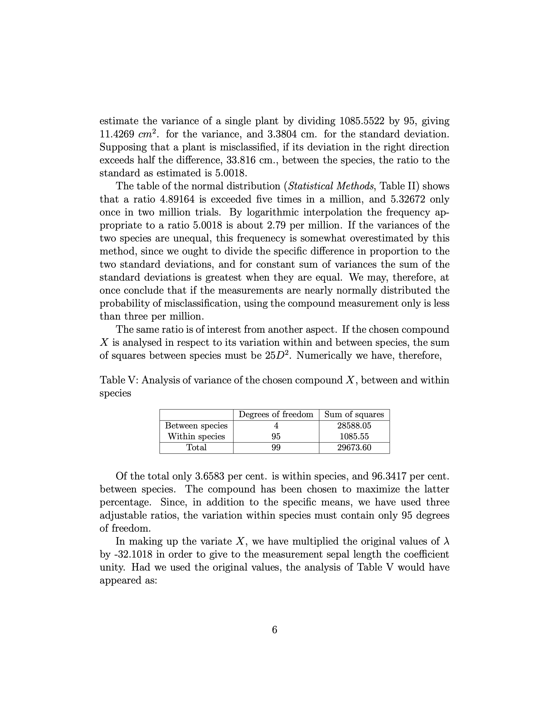
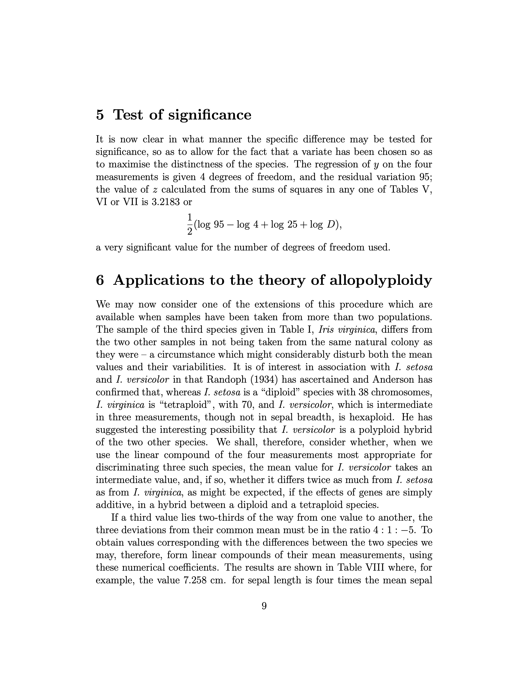
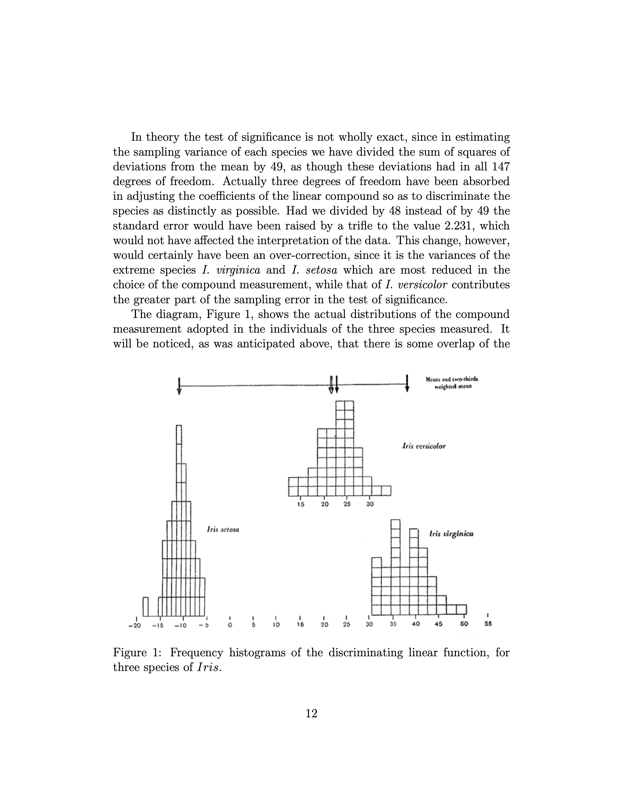
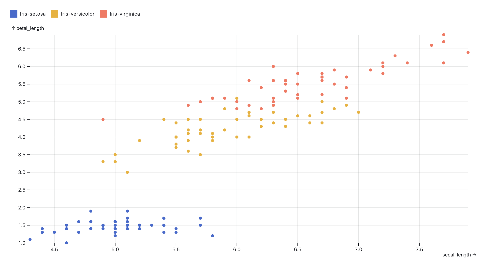
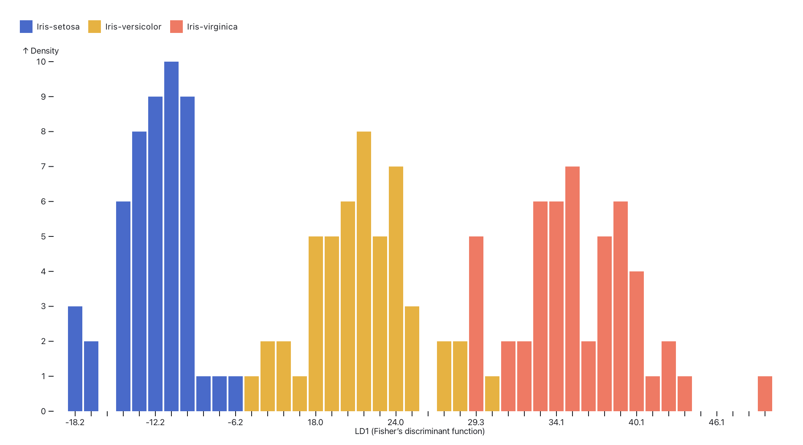
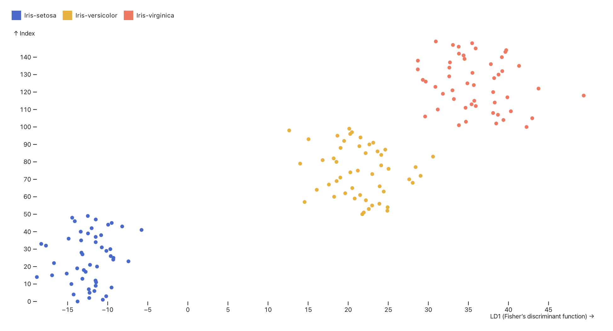

# LaTeX markup

https://github.com/raskumandrin/fisher/blob/main/fisher.tex

https://www.overleaf.com/project/68a4b8db8d2e7c9b67a2850e

# Rendered pdf

---

https://observablehq.com/d/27597228b2335087

---

https://en.wikipedia.org/wiki/Iris_flower_data_set

